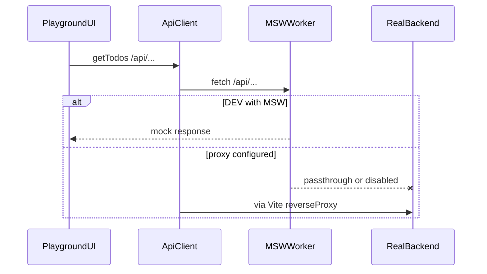

# API & MSW

## Contract → client

1. Edit `packages/api/src/contracts/openapi.yaml`.
2. Run `pnpm generate-api` (or `pnpm --filter=@vue-workspace/api generate-api`).
3. Import from:

| Export | Import path |
|--------|-------------|
| SDK methods | `@vue-workspace/api` |
| Types | `@vue-workspace/api/types` |
| Fetch client | `@vue-workspace/api/client` |
| Valibot schemas | `@vue-workspace/api/schemas` |

Generated files under `packages/api/src/api/` are ESLint-ignored — do not edit by hand.

The generated client uses `baseUrl: '/api'`.

## Local mocks (playground)

In development, playground boots MSW before mounting the app (`libs/msw/msw-setup.ts`). Handlers live under `src/mocks/<resource>/` and are registered with the worker.

Flow:

## Real backend proxy

Set `VITE_API_PROXY_TARGET` (see `apps/playground/.env.example`). Playground Vite config uses `reverseProxy()` from `@vue-workspace/vite-config` so `/api/*` is forwarded to that origin (path prefix stripped).

MSW still runs in DEV; disable or bypass mocks when you need the real API.

## Todos list query

`GET /todos` supports pagination plus optional filters/sort (see OpenAPI):

| Query | Role |
|-------|------|
| `start`, `limit` | Offset pagination (required) |
| `title` | Case-insensitive substring on title |
| `status` | Exact `TodoStatus` |
| `sortBy` | `title` \| `status` \| `createdAt` \| `updatedAt` (default `createdAt`) |
| `sortOrder` | `asc` \| `desc` (default `desc`) |

MSW applies filter → sort → slice. Response `total` is the **filtered** count, not the full collection size.
